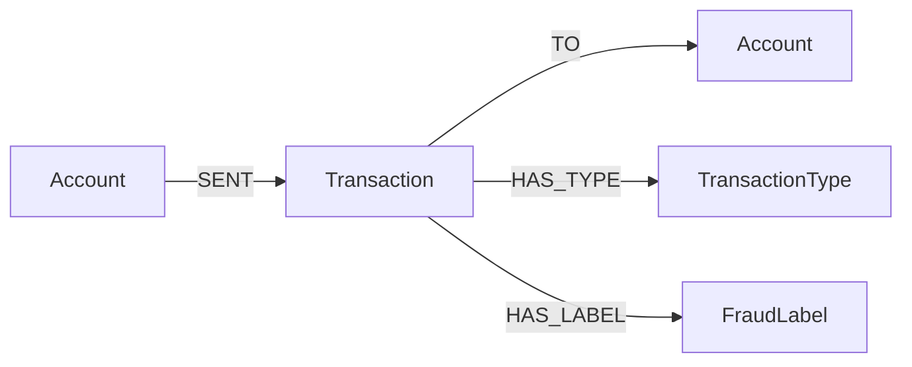

# FraudGraph Sentinel

**Graph-powered cyber-fraud investigation agent on Neo4j Aura.**

Flat fraud classification can flag suspicious rows. FraudGraph Sentinel turns synthetic transaction data into a context-rich graph so an Aura Agent can reason over repeated recipients, suspicious money movement paths, and connected fraud patterns.

## Why A Graph

Financial fraud is relational. A single transaction row shows an amount and label, but a graph can reveal:

- destination accounts receiving repeated fraudulent movements
- high-value paths from source account to destination account
- differences between fraudulent `TRANSFER` and `CASH_OUT` behavior
- account neighborhoods that explain why a pattern is suspicious

## Dataset

Source dataset: `Synthetic_Financial_datasets_log.csv`

The full source contains **6,362,620** synthetic mobile-money transaction rows. The AuraDB Free build keeps every fraud row and a deterministic non-fraud sample:

- fraud rows selected: **8,213**
- non-fraud rows sampled: **5,000**
- sampling rule: `all_fraud_plus_first_n_non_fraud`
- source dataset is not modified
- raw datasets are not committed to the repository

## Graph Schema



## Verified Graph Statistics

Base compact transaction graph:

| Metric | Count |
|---|---:|
| Accounts | 24,365 |
| Transactions | 13,213 |
| Transaction types | 5 |
| Fraud labels | 2 |
| Total nodes | 37,585 |
| Total relationships | 52,852 |
| Fraud transactions | 8,213 |

Optional risk-indicator enhancement imported into AuraDB:

| Metric | Count |
|---|---:|
| Email samples | 800 |
| URL samples | 400 |
| Risk indicators | 12 |
| Additional relationships | 21,410 |
| Enhanced total nodes | 38,797 |
| Enhanced total relationships | 74,262 |

Free-tier safety target:

- node limit target: **50,000**
- relationship limit target: **175,000**
- current status: **safe**

The optional enhancement links separate email, URL, and transaction samples through shared risk indicators. It does **not** claim that any phishing email caused any transaction.

## Agent Tools

Primary tools:

- Cypher Templates for known investigation workflows
- Text2Cypher for read-only ad-hoc graph questions

Aura Console files:

- `outputs/fraudgraph_sentinel/agent_tools.json`
- `outputs/fraudgraph_sentinel/aura_agent_import_config.json`

Prepared Cypher Template tools:

- `fraud_overview`
- `repeated_fraud_destinations`
- `high_value_fraud_paths`
- `account_fraud_neighborhood`
- `fraud_type_comparison`
- `fraud_concentration`
- `risk_indicator_overview`
- `shared_risk_indicator_context`

Similarity Search over `Transaction.riskText` can be added later if embeddings are configured. It is not required for the zero-cost submission path.

## Demo Questions

```text
Which destination accounts received multiple fraudulent transfers?
```

```text
Compare fraudulent TRANSFER and CASH_OUT activity.
```

```text
Show the highest-value suspicious fraud paths.
```

```text
Why is this repeated destination pattern suspicious?
```

## Local Development

Install dependencies:

```powershell
python -m pip install -e .
```

Run tests:

```powershell
pytest -q
```

Run the compact validation suite:

```powershell
$env:PYTHONPATH = "$PWD\src"
python -m fraudgraph_sentinel.validation_runner
```

Generate the compact graph bundle:

```powershell
$env:PYTHONPATH = "$PWD\src"
python -m fraudgraph_sentinel.cli `
  --input ".\datasets\cyber_security_fraud_phishing\Synthetic_Financial_datasets_log.csv" `
  --output ".\outputs\fraudgraph_sentinel" `
  --max-non-fraud 5000
```

Safe AuraDB checks:

```powershell
$env:PYTHONPATH = "$PWD\src"
python -m fraudgraph_sentinel.aura_cli --env-file .env env-check
python -m fraudgraph_sentinel.aura_cli --env-file .env connect
python -m fraudgraph_sentinel.aura_cli --env-file .env verify
python -m fraudgraph_sentinel.aura_cli --env-file .env query-check
```

Import the compact bundle into an existing AuraDB Free database:

```powershell
$env:PYTHONPATH = "$PWD\src"
python -m fraudgraph_sentinel.aura_cli --env-file .env import `
  --bundle ".\outputs\fraudgraph_sentinel" `
  --batch-size 1000
```

Build and import the optional risk-indicator enhancement:

```powershell
$env:PYTHONPATH = "$PWD\src"
python -m fraudgraph_sentinel.risk_cli `
  --email-xlsx ".\datasets\cyber_security_fraud_phishing\phishing_dataset (1).xlsx" `
  --url-csv ".\datasets\cyber_security_fraud_phishing\PhiUSIIL_Phishing_URL_Dataset.csv" `
  --transactions-csv ".\outputs\fraudgraph_sentinel\transactions.csv" `
  --output ".\outputs\fraudgraph_sentinel_risk"

python -m fraudgraph_sentinel.aura_cli --env-file .env import-risk `
  --bundle ".\outputs\fraudgraph_sentinel_risk" `
  --batch-size 1000
```

## Configuration Safety

Copy `.env.example` to `.env` locally and fill in the existing AuraDB Free database credentials. Never commit `.env`.

Required:

- `NEO4J_URI`
- `NEO4J_USERNAME`
- `NEO4J_PASSWORD`
- `NEO4J_DATABASE`

The scripts print only `PRESENT` or `MISSING` for environment checks. They do not print credentials.

## Cost And Security Notes

- Designed for an existing Neo4j AuraDB Free instance.
- Does not create paid Aura resources.
- Does not import the full 6.3-million-row dataset.
- Uses synthetic fraud data only.
- Public agent deployment is not required for the submission and may incur cost.
- Aura Console screenshots should not include credentials.

## Submission Materials

- [Aura Agent setup guide](docs/aura-agent-setup.md)
- [Create with AI fallback prompt](docs/create-with-ai-prompt.md)
- [Demo script](docs/demo-script.md)
- [Submission draft](docs/agent_submission.md)
- [Hackathon thread reply draft](docs/hackathon-thread-reply.md)
